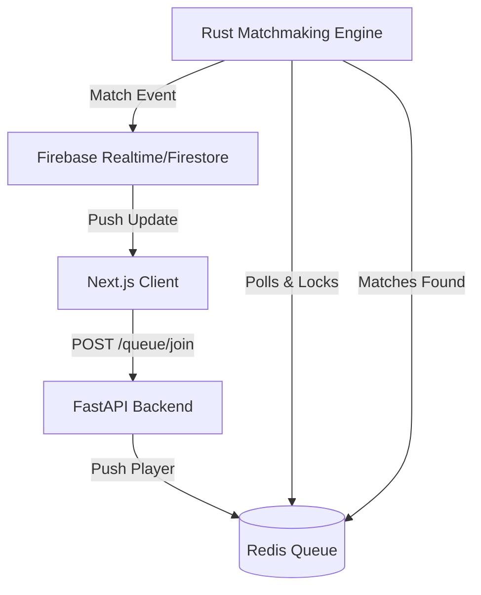

# Skill-Based Matchmaking System Implementation Plan

This project will implement a robust, highly scalable matchmaking system with a Rust engine, Python FastAPI backend, Next.js frontend, and Redis for the queue state. Firebase will be used for real-time notifications.

## User Review Required
> [!IMPORTANT]
> Please review this plan carefully. Once approved, I will begin by generating the folder structure, configuring Docker Compose, and writing the core Rust matchmaking logic.

## Open Questions
> [!WARNING]
> 1. **Firebase Configuration**: The system requires Firebase for Auth and Realtime updates. You will need to create a Firebase project and provide the client and admin credentials via `.env` files once we start setting up the respective services. Are you comfortable with setting this up later?
> 2. **Configurability**: For the matchmaking weights and thresholds, I plan to use a `.env` file or a simple configuration file loaded at startup for the Rust engine. Does this work for you?

## Proposed Architecture & Structure

The workspace will be organized into the following components:

### `docker-compose.yml`
- Redis server
- Local dev environment orchestration

### `engine/` (Rust)
- Pure logic modules: `scoring`, `team_formation`, `bucket_expansion`.
- IO modules: `redis_client`, `engine_loop`.
- Unit tests for all pure logic.

### `api/` (FastAPI)
- Endpoints: `POST /queue/join`, `POST /queue/leave`, `GET /match/status/{player_id}`, `GET /match/{match_id}`.
- Shared Player data model definition.
- Integration tests.

### `frontend/` (Next.js)
- Next.js App Router with TypeScript.
- Real-time queue timer and Firebase listeners.
- Match found screen with team rosters and match quality score.
- Dashboard analytics view.

## Implementation Phases

### Phase 1: Core Rust Matchmaking Engine (Pure Logic)
- Define `Player` and `Match` models.
- Implement queue bucket logic, dynamic MMR range expansion (0-5s, 5-10s, 10s+).
- Implement multi-factor scoring algorithm (MMR diff, latency, roles, behavior score).
- Implement constraint validation (team size, role composition, region).
- Write comprehensive unit tests for the pure matching logic.

### Phase 2: Engine I/O and Redis Integration
- Setup `docker-compose.yml` for Redis.
- Implement Rust Redis client to pull candidates per region.
- Implement horizontal scaling mechanisms (Redis locks/atomic ops) to allow multiple Rust engine workers.
- Add basic benchmark/load-test harness.

### Phase 3: FastAPI Backend
- Scaffold FastAPI project.
- Implement Queue API (`/join`, `/leave`) interacting with Redis.
- Implement Match API (`/status`, `/match_id`).
- Add basic integration tests.

### Phase 4: Firebase Integration
- Configure Firebase Admin SDK in FastAPI/Rust (to push events).
- Emit match events to Firebase on match formation.

### Phase 5: Next.js Frontend
- Scaffold Next.js project.
- Implement dynamic, beautiful UI (Aesthetics priority).
- Build queue join/leave flow with realtime timer.
- Integrate Firebase client SDK to listen for match events.
- Build "Match Found" screen and simple analytics view.

## Verification Plan

### Automated Tests
- Rust: `cargo test` for pure logic (scoring, matching).
- FastAPI: `pytest` for endpoint validation.

### Manual Verification
- Run the full stack via `docker-compose`.
- Open multiple browser tabs (Next.js frontend) and join the queue.
- Verify that players are correctly bucketed and matched.
- Verify real-time updates via Firebase work seamlessly.
- Verify match quality scores and dynamic expansion logic via logging/UI.
